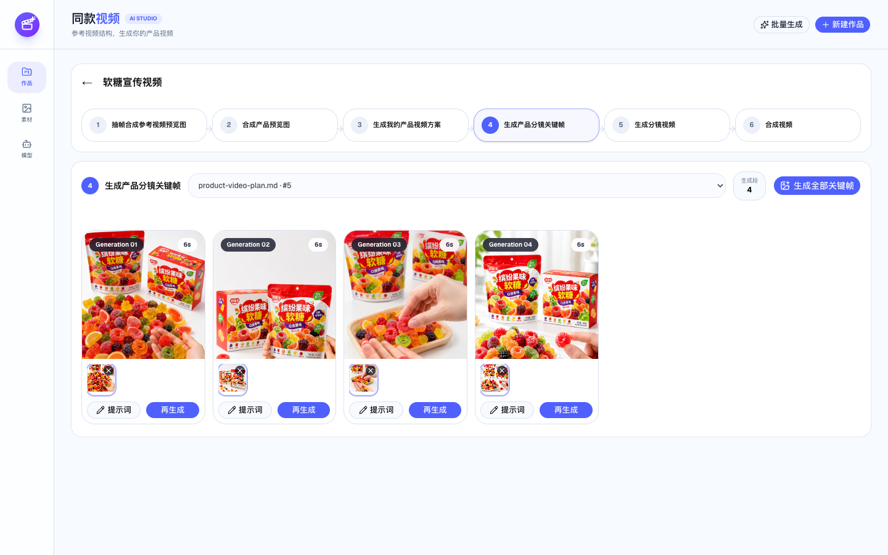
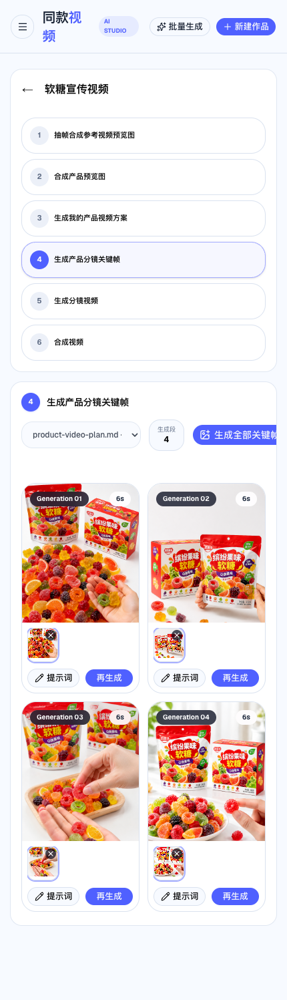

# AI Product Reel

基于参考视频结构，使用 AI 自动生成产品故事板、关键帧、分镜视频、最终成片和剪映草稿。

这个仓库不仅提供一个可运行的 AI 视频应用，也是一套 Codex 实战教学项目。你可以参考仓库中的需求文档和真实运行截图，学习如何让 Codex 实现一个包含前端、数据库、模型调用、异步任务和 FFmpeg 媒体处理的产品。

## 项目运行界面

### PC 端



### 移动端

<p align="center">
  
</p>

[查看全部桌面端和移动端截图](./docs/design/README.md)。

## 项目能做什么

用户上传一条参考视频和一组产品图片后，可以依次完成：

```text
参考视频
  → 智能抽帧
  → 视频总览
  → 结构脚本
  → 产品参考
  → 故事板
  → 关键帧提示词
  → 关键帧图片
  → 视频提示词
  → 分镜视频
  → 合成最终视频
  → 生成剪映草稿
```

主要功能包括：

- 创建、重命名和删除视频作品。
- 管理参考视频与产品图片素材组。
- 从参考视频均匀抽帧并生成视频总览图。
- 将多张产品图片合成为产品预览图。
- 使用多模态模型分析镜头结构和广告节奏。
- 根据参考结构与产品素材生成新故事板。
- 为每个 Generation 生成和编辑关键帧提示词。
- 调用图片模型生成多个关键帧候选版本。
- 选择关键帧并提交异步图生视频任务。
- 轮询、恢复、重试和管理视频生成任务。
- 使用 FFmpeg 按分镜顺序合成最终视频。
- 上传补充媒体并生成剪映草稿。
- 选择多个产品素材组执行批量生成。
- 自定义多模态、图片和视频模型配置。

## 为什么适合作为 Codex 教学项目

这个项目覆盖了 AI 应用开发中非常典型的工程问题：

- 如何把复杂需求拆成可以交给 Codex 的小任务。
- 如何让 Codex 在修改前阅读当前版本的框架文档。
- 如何设计 Next.js 前后端一体化应用。
- 如何保存、读取和删除大型媒体文件。
- 如何处理不稳定且格式不完全可信的模型输出。
- 如何管理长时间运行的异步视频任务。
- 如何让页面在刷新后恢复任务状态。
- 如何使用 FFmpeg 处理真实视频。
- 如何通过验收标准、测试和 Git 提交控制 Codex 的改动质量。

建议不要一次要求 Codex 完成整个项目。按照需求文档中的实施顺序逐个实现闭环，每完成一个阶段就检查 diff、运行验证并提交代码。

## 技术栈

| 分类 | 技术 |
| --- | --- |
| 全栈框架 | Next.js 16 App Router |
| 前端 | React 19、TypeScript |
| 样式与组件 | Tailwind CSS、shadcn/ui、Base UI |
| 数据库 | SQLite、better-sqlite3 |
| 媒体处理 | FFmpeg、FFprobe |
| AI 接口 | OpenAI 兼容多模态与图片接口、异步视频生成接口 |
| 图表与交互 | Recharts、Embla Carousel、Lucide React |
| 代码质量 | Oxlint、Oxfmt |

## 系统结构

```text
浏览器
  │
  ├─ 作品与素材管理
  ├─ 十步创作工作台
  ├─ 模型设置
  └─ 批量任务进度
  │
Next.js Route Handlers
  │
  ├─ SQLite 数据与媒体分块存储
  ├─ 多模态模型调用
  ├─ 图片生成调用
  ├─ 视频任务提交与状态刷新
  ├─ FFmpeg 抽帧、探测与视频合成
  └─ 剪映草稿服务
```

## 开始使用

### 1. 环境要求

- Node.js `22.13.0` 或更高版本。
- npm。
- FFmpeg 和 FFprobe。
- 可用的多模态、图片和视频模型服务。

确认本机环境：

```bash
node --version
npm --version
ffmpeg -version
ffprobe -version
```

### 2. 克隆仓库

```bash
git clone https://gitee.com/alinec/ai-product-reel.git
cd ai-product-reel
```

### 3. 安装依赖

```bash
npm install
```

### 4. 配置环境变量

复制环境变量示例：

```bash
cp .env.example .env.local
```

可用配置：

```dotenv
# 可选：修改 SQLite 数据库位置
SQLITE_PATH=.data/ai-product-reel.sqlite

# 剪映草稿服务
CAPCUT_MATE_BASE_URL=
CAPCUT_MATE_API_KEY=

# 远程草稿服务读取本地媒体时使用的可访问地址
DRAFT_ASSET_BASE_URL=

# 可选：自定义 FFmpeg 和 FFprobe 路径
FFMPEG_PATH=ffmpeg
FFPROBE_PATH=ffprobe
```

不要把真实 API Key 写入 `.env.example`，也不要提交 `.env.local`。

### 5. 启动开发服务器

```bash
npm run dev
```

浏览器访问：

```text
http://localhost:3000
```

### 6. 配置 AI 模型

进入应用的“模型”设置，分别填写：

- 多模态模型：分析参考视频并生成故事板。
- 图片模型：根据产品参考图生成关键帧。
- 视频模型：根据选中的关键帧生成分镜视频。

每类配置包含：

- 模型 ID。
- Base URL。
- API Key。

保存前可以使用“测试连接”确认地址、鉴权和模型是否可用。

## 推荐使用流程

### 第一步：准备素材

1. 在“素材”中创建参考视频素材组。
2. 上传一条产品广告参考视频。
3. 创建产品图片素材组，并关联参考视频组。
4. 上传商品正面、侧面、细节和使用场景图片。

### 第二步：创建作品

1. 返回“作品”。
2. 点击“新建作品”。
3. 输入作品名称并进入工作台。

### 第三步：生成方案

1. 选择参考视频。
2. 生成参考视频总览图。
3. 使用多模态模型分析镜头结构。
4. 选择产品图片并生成产品预览图。
5. 填写可选的产品卖点和创作要求。
6. 生成产品故事板。

### 第四步：生成媒体

1. 检查每个 Generation 的关键帧提示词。
2. 生成关键帧图片。
3. 为每个 Generation 选择一个关键帧版本。
4. 检查视频提示词并提交视频任务。
5. 等待任务完成，为每段选择一个视频版本。

### 第五步：导出

1. 合成已选中的分镜视频。
2. 播放和下载最终成片。
3. 根据需要上传音频、图片或视频附件。
4. 生成剪映草稿继续编辑。

## 项目目录

```text
ai-product-reel/
├── app/
│   ├── api/                  # Next.js Route Handlers
│   ├── workflows/[id]/       # 作品详情路由
│   ├── globals.css           # 全局样式
│   ├── layout.tsx            # 根布局与页面元数据
│   └── page.tsx              # 主工作台界面
├── components/ui/            # 通用 UI 组件
├── db/schema.ts              # SQLite 表结构
├── docs/                     # 教学与产品文档
├── hooks/                    # React Hooks
├── lib/
│   ├── database.ts           # SQLite 封装
│   ├── workflow-db.ts        # 作品数据初始化
│   ├── binary.ts             # 二进制分块处理
│   ├── ffmpeg.ts             # 媒体探测与视频合成
│   └── *-prompt.ts           # AI 提示词与构建函数
├── public/                   # 公共图片资源
├── .env.example              # 环境变量示例
├── AGENTS.md                 # Codex 项目级开发规则
└── package.json
```

本地运行生成的数据库默认位于 `.data/`，该目录不会提交到 Git。

## 需求文档与运行截图

- [需求文档](./docs/需求文档.md)：了解当前六步工作流、功能模块、验收要点和建议实施顺序。
- [全部运行截图](./docs/design/README.md)：查看作品、素材、模型设置、批量生成和六步工作台的桌面端及移动端界面。

## 下一步导航 Skill

仓库内置了 `ai-product-reel-next-step` Skill，用于检查真实项目进度，并推荐一个可以验证和提交的下一步开发闭环。

在 Codex 中调用：

```text
$ai-product-reel-next-step 检查当前项目进度并告诉我下一步该做什么。
```

也可以使用自然语言：

```text
按需求文档的实施顺序检查一下，我下一步应该实现什么？
```

Skill 会读取 Git 状态、需求文档、相关验收标准和真实代码证据，并输出：

- 当前阶段及完成状态。
- 支持判断的文件、测试或命令证据。
- 一个最小且明确的下一步。
- 涉及范围和验收标准。
- 一段可以直接交给 Codex 执行的任务提示词。

默认情况下 Skill 只检查和建议，不会修改代码。只有明确要求“实现下一步”时，它才会执行对应开发任务；提交、推送、部署和付费模型调用仍需单独授权。

## 使用 Codex 开发

每次让 Codex 修改项目时，建议使用以下模板：

```text
请先阅读：
1. AGENTS.md；
2. docs/需求文档.md 中与本任务相关的功能要求和验收要点；
3. node_modules/next/dist/docs 中与本任务相关的文档（修改 Next.js 代码时）。

本次目标：<只填写一个明确的功能目标>。
允许修改：<目录或模块>。
保持不变：<不能破坏的现有功能>。

验收标准：
1. <用户行为标准>；
2. <数据正确性标准>；
3. <异常处理标准>；
4. <测试标准>。

请先检查当前实现和 Git 状态，再直接完成修改。保留已有改动，不要提交数据库、密钥、生成媒体或本地缓存。完成后运行相关格式化、Lint、测试和生产构建，并说明改动、验证结果和剩余风险。
```

Codex 修改完成后，不要只看它的总结。还应执行：

```bash
git diff --check
git diff
npm run lint
npm run build
```

如果项目已经配置测试脚本，还需要运行完整测试。

## 常用命令

```bash
# 启动开发服务器
npm run dev

# 生产构建
npm run build

# 启动生产服务器
npm run start

# 静态检查
npm run lint

# 格式化代码
npm run format
```

## 数据与安全说明

当前项目主要面向单用户、本地教学和原型验证。请注意：

- 不要提交 `.env`、`.env.local`、`.data` 或任何真实 API Key。
- 不要在截图、日志、模型响应或错误信息中暴露鉴权信息。
- 面向公网部署前，应增加用户认证和作品权限检查。
- 公网接口不得向浏览器返回完整 API Key。
- 上传文件需要限制类型、数量和体积。
- 下载远程模型结果时需要防范 SSRF、超时和超大响应。
- 大量视频不适合长期保存在单机 SQLite 中，生产环境应考虑对象存储、任务队列和独立数据库。

## 当前定位

这是一个功能链路完整的教学型 AI 应用原型，不应直接视为生产级多用户服务。仓库保留了真实工程复杂度，适合用于演示如何借助 Codex 逐步完成需求分析、页面开发、数据建模、模型接入、媒体处理和质量收尾。

## 仓库地址

[https://gitee.com/alinec/ai-product-reel](https://gitee.com/alinec/ai-product-reel)
